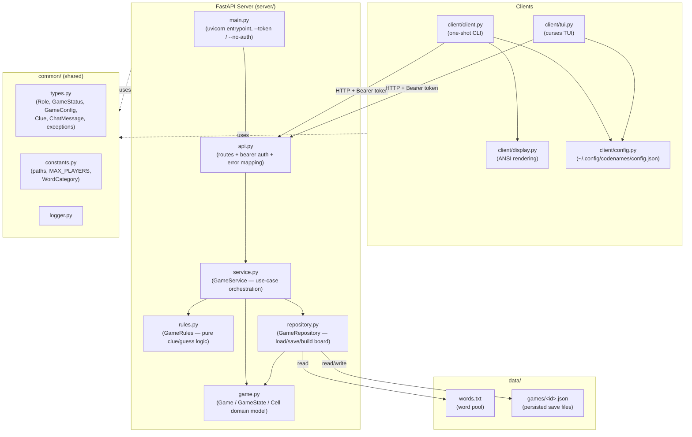
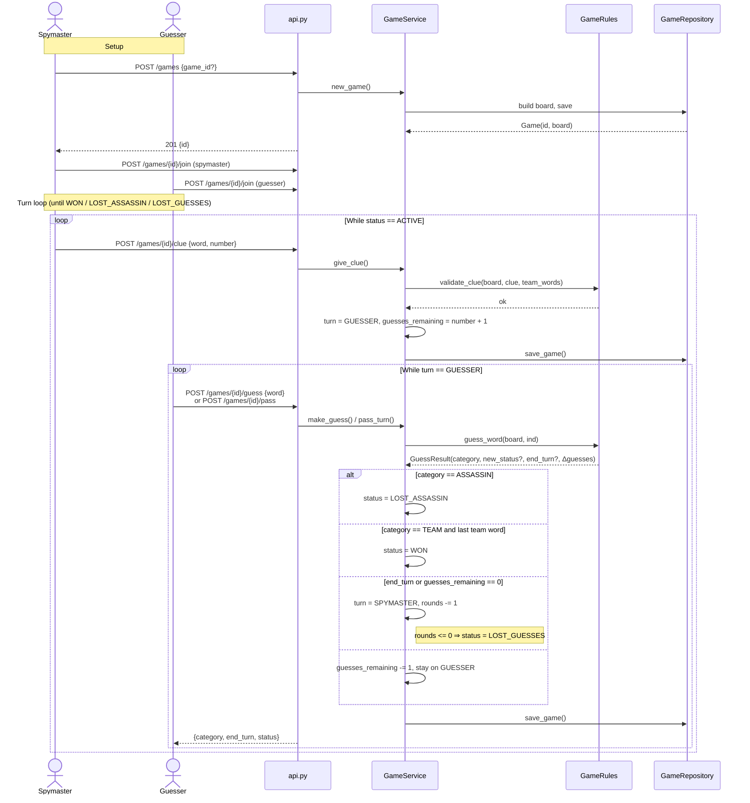
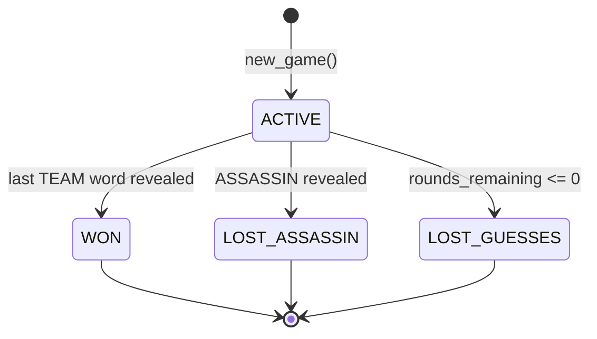

# Cooperative Codenames

A cooperative twist on Codenames: instead of two competing teams, you and a teammate work together
to reveal all of *your* team's words on the board before running out of guess rounds — while
avoiding the assassin and bystanders. One player is the **spymaster** (sees the key, gives clues),
the other is the **guesser** (sees only revealed cells, picks words).

The project ships:

- A **FastAPI** server that owns game state and rules.
- A **CLI** client (`codenames`) for one-shot commands.
- A **curses TUI** client (`codenames-tui`) for an interactive board view.

---

## Architecture

The server is layered: HTTP at the edge, a service orchestrating use-cases, pure rules, and a
repository that persists each game as a JSON file under `data/games/`. Clients are HTTP-only and
share types with the server via the `common/` package.



### Why these layers

- **`api.py`** translates HTTP ↔ Python: parses Pydantic request bodies, enforces the bearer token,
  and maps domain exceptions (`GameNotFound`, `WrongTurn`, `GameAlreadyOver`, `InvalidAction`) to
  the right HTTP status codes. It contains no game logic.
- **`service.py`** is the only place that mutates a game *and* persists it. Every public method
  loads → asserts preconditions (turn, status) → applies rules → saves.
- **`rules.py`** is pure and stateless: clue validation, guess outcome (team / bystander / assassin
  / win), and turn-end logic. Easy to unit-test in isolation.
- **`repository.py`** is the only component that touches the filesystem. It builds new boards by
  shuffling categories from `GameConfig` over the words in `words.txt`, and serializes
  `GameState` + `GameConfig` together via `dataclass-wizard`.
- **`game.py`** is the domain model — read accessors and small mutators on `GameState`. No I/O.

---

## Game Workflow

A game is a loop of **clue → guess(es) → end of turn**, bounded by `guess_rounds` (default 5).
The board has 25 cells: 9 team words, 15 bystanders, 1 assassin (configurable in `GameConfig`).



### Status transitions



---

## File Reference

### `server/`
| File | Purpose |
|---|---|
| `main.py` | Argparse entrypoint. Sets `CODENAMES_TOKEN` env var and starts uvicorn on `server.api:app`. Requires `--token` unless `--no-auth`. |
| `api.py` | FastAPI app. Pydantic request bodies, `HTTPBearer` auth dependency, route handlers for `/games`, `/games/{id}`, `/join`, `/clue`, `/guess`, `/pass`, `/chat`. Maps domain exceptions to HTTP status codes. |
| `service.py` | `GameService` — orchestrates use cases. Loads game, asserts active + correct turn, calls `GameRules`, mutates the `Game`, saves via `GameRepository`. |
| `rules.py` | Pure game logic: `validate_clue`, `guess_word` (returns a `GuessResult`), turn-end + win/lose detection. No I/O, no state. |
| `repository.py` | `GameRepository` — JSON persistence under `data/games/<id>.json` using `dataclass-wizard`. Loads `words.txt` and builds a randomized board from `GameConfig`. |
| `game.py` | Domain model: `Cell`, `GameState`, `Game`. Read accessors + small mutators (`reveal`, `add_clue`, `set_turn`, `add_chat`, `log_action`, …). |
| `__init__.py` | Marks `server/` as a package. |

### `client/`
| File | Purpose |
|---|---|
| `client.py` | One-shot CLI (`codenames`). Subcommands: `configure`, `new`, `join`, `spymaster [word number]`, `guesser [word\|pass]`, `delete`, `reset`. Talks to the server via `httpx`. |
| `tui.py` | Curses-based interactive client (`codenames-tui`). Screens: Menu / Create / Join / Settings / Game. Embeds `CodenamesClient` (`httpx`) and polls every `REFRESH_INTERVAL` (3s). Slash commands in-game: `/clue <word> <n>`, `/pass`, `/guess <word>`; arrow keys navigate the board for the guesser; bare text is sent as chat. |
| `display.py` | ANSI rendering helpers used by the CLI client: `render_board`, `print_status`, `print_clues`, `print_error/success/warning`. |
| `config.py` | `CLIConfig` dataclass + load/save/reset helpers, persisted to `~/.config/codenames/config.json` (host, token, current game_id, name, role). |
| `debug.py` | Small developer helper that prints the current game state via `CodenamesClient.get_game()`. |
| `__init__.py` | Marks `client/` as a package. |

### `common/`
| File | Purpose |
|---|---|
| `types.py` | `GameConfig`, `ChatMessage`, `Clue`, enums `GameStatus` (`ACTIVE`/`WON`/`LOST_*`) and `Role` (`SPYMASTER`/`GUESSER`), and exception hierarchy `GameNotFound`, `GameServiceError` → `InvalidAction` → `WrongTurn`, `GameAlreadyOver`. |
| `constants.py` | `BASE_DIR`, `WORDS_PATH`, `GAMES_DIR`, `MAX_PLAYERS_PER_GAME`, and `WordCategory` enum (`TEAM`/`BYSTANDER`/`ASSASSIN`). |
| `logger.py` | `setup_logger(level)` — `logging.basicConfig` with a consistent format. |
| `__init__.py` | Marks `common/` as a package. |

### `data/`
| File | Purpose |
|---|---|
| `words.txt` | The word pool the repository draws from when building a new board. |
| `games/` | Created on first save. Each game is one JSON file `{game_id}.json` containing `{config, state}`. |

### Top level
| File | Purpose |
|---|---|
| `pyproject.toml` | Project metadata, deps (`fastapi`, `uvicorn`, `httpx`, `dataclass-wizard`, `windows-curses` on Windows), and console scripts: `codenames` → CLI, `codenames-tui` → TUI. |

---

## Quick Start

```bash
# Install (from the repo root)
pip install -e .

# Run the server (auth required by default)
python -m server.main --token devtoken

# Configure the client (one-time)
codenames configure --host localhost:5000 --token devtoken

# Play (in two terminals / on two machines)
codenames new
codenames join <game_id> --name alice --role spymaster
codenames join <game_id> --name bob   --role guesser

# Or use the interactive TUI
codenames-tui
```

### HTTP API summary

| Method | Path | Body | Notes |
|---|---|---|---|
| `POST` | `/games` | `{game_id?}` | Creates a game; 201 with `{id}`. |
| `GET` | `/games/{id}` | — | Returns full `{config, state}`. |
| `DELETE` | `/games/{id}` | — | Deletes the save file. |
| `POST` | `/games/{id}/join` | `{name, role}` | Idempotent for an existing player (returns `resumed: true`). |
| `POST` | `/games/{id}/clue` | `{word, number}` | Spymaster only; switches turn to guesser. |
| `POST` | `/games/{id}/guess` | `{word}` | Guesser only; returns `{category, end_turn, status}`. |
| `POST` | `/games/{id}/pass` | — | Guesser only; ends turn, decrements rounds. |
| `POST` | `/games/{id}/chat` | `{name, msg}` | Appends to the chat log. |

All endpoints require `Authorization: Bearer <token>` unless the server was started with `--no-auth`.
